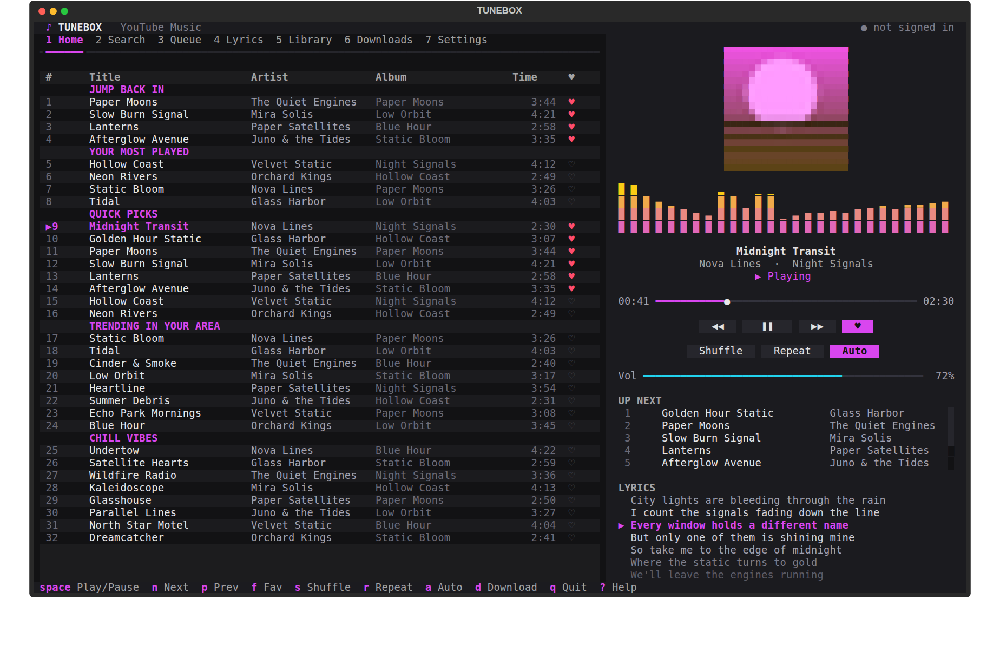
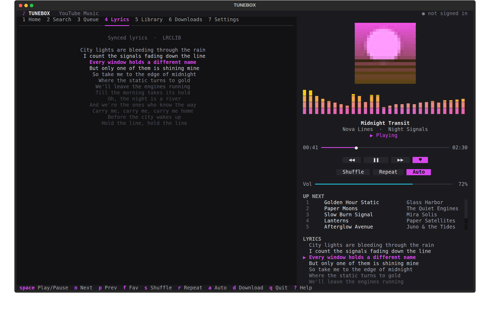
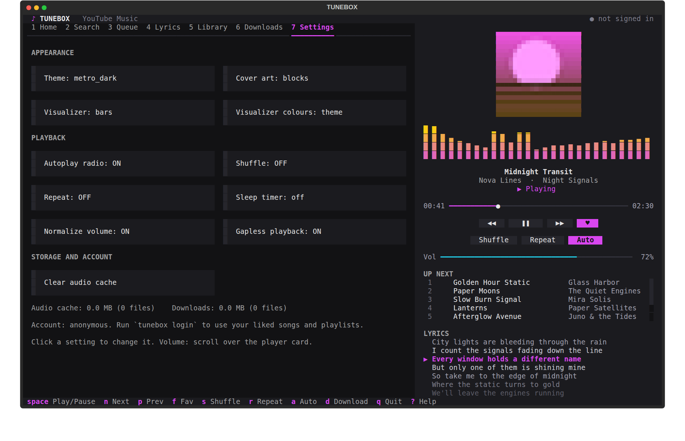

# Tunebox

A YouTube Music client for the terminal, inspired by **Metrolist for Android**.
Search, stream, queue, favorite, see synced lyrics, and download tracks, all with mouse or keyboard.

Built on [Textual](https://textual.textualize.io/), `yt-dlp`, `ytmusicapi` and `pygame.mixer`.

[](https://codespaces.new/idea90/tunebox)



<p>


</p>

(Screenshots use demo data. On terminals with a graphics protocol the cover is drawn as a real image.)

---

## Features

- **Streaming playback** with seek, shuffle, repeat (off / all / one) and autoplay radio when the queue ends.
- **Gapless playback**: the next song is pre-fetched and handed to the audio engine, so consecutive tracks play without a gap.
- **Loudness normalization** (-16 LUFS): quiet and loud songs play at a similar volume. Applies to songs cached from now on.
- **Resumes where you left off**: the queue, current song and position are restored on launch (press Space).
- **Artist, album and playlist pages** with a full song list, Play all and Shuffle. Press `g` / `b` on any song to jump to its artist / album.
- **Search suggestions** as you type (your own recent searches first), accepted with the Right arrow.
- **Sleep timer** (15 / 30 / 60 / 90 min) that pauses playback when it runs out.
- **Queue editing**: play next, add to queue, reorder, remove, and save the queue as a playlist (`S`).
- **Your YouTube Music account** (optional): liked songs and your playlists, via `tunebox login`.
- **Media keys** (optional): hardware play/pause/next/previous, via `pip install "tunebox[media]"`.
- **Desktop media controls on Linux (MPRIS)**: the song, artist, cover and play state show in your desktop's media widget, lock screen, KDE Connect and `playerctl`, and their buttons, seek bar and volume control Tunebox.
- **Runs on Android (Termux)** with a phone-sized layout: one column, a mini player with big touch buttons, and the full player a tap away. See [Termux](#termux-android).
- **Built-in help**: press `?` for every shortcut, with a filter box.
- **Mouse and keyboard**: click a song to play it, click the seek bar, click the heart, click the control chips, scroll over the player card for volume.
- **Album art in the terminal**: the playing song's official album cover (looked up on iTunes, then Deezer; never a YouTube video frame), also embedded in downloads. On terminals with a graphics protocol it is drawn as a real image (kitty and Ghostty via the kitty protocol; WezTerm, Windows Terminal 1.22+, iTerm2, foot and Konsole via Sixel). Everywhere else it falls back to colored ASCII art or sharp half-block pixels. Press `i` to cycle `auto` / `ascii` / `blocks` / `off`.
- **Home that knows you**: "Jump back in", "Your most played" and "Because you played ..." (suggestions based on your latest song) sit above YouTube's own shelves, built from your listening history.
- **Copy to clipboard**: `y` copies a link to the highlighted (or playing) song, album, artist or playlist, or the lyrics when you are on the Lyrics tab. `Y` always copies the lyrics (without timestamps).
- **Audio visualizer** in the player: the real spectrum of the playing song, in sync with playback. Pick bars, mirror or line, and theme, rainbow, fire or mono colours (`v` / `V`, or Settings).
- **Live, synced lyrics** from [LRCLIB](https://lrclib.net) with a YouTube Music fallback. Click a line to jump to it.
- **Library** in a local SQLite database: favorites, custom playlists, history, most played.
- **Downloads** to MP3 / M4A / FLAC with title, artist, album and cover art tags embedded. Download a **whole playlist or album** in one go (`D`, or `tunebox download-playlist`): one folder per playlist, a progress counter in the top bar, stop any time, and re-running only fetches what is missing.
- **Four themes**: `metro_dark`, `neon_purple`, `emerald`, `cyberpunk`. Colour is kept for what matters: the playing song, the active tab, the selection, hearts. Lists show an Album column on wide terminals, tabs shorten themselves on narrow ones, and empty tabs say what to do next.
- **One-shot commands** (`play`, `search`, `lyrics`, `download`, `charts`, ...) that don't open the app.

## Install

Requires Python 3.9+.

```bash
pip install -r requirements.txt
```

Optional, to get a `tunebox` command:

```bash
pip install -e .
```

## Run

```bash
python run.py          # interactive app
tunebox.bat          # Windows launcher
tunebox              # if installed with pip install -e .
```

Use a terminal with mouse support and a font that has the symbols `♥ ♡ ▶ ❚❚ ━ ●`
(Windows Terminal, iTerm2, GNOME Terminal, kitty, etc.).

## Termux (Android)

Tunebox runs in [Termux](https://termux.dev) (install it from F-Droid, not the Play Store). Audio plays through `mpv`,
because pygame has no audio output on Android.

```bash
pkg install git
git clone <this repository> tunebox && cd tunebox
bash termux-install.sh        # installs python, ffmpeg, mpv, numpy, pillow, termux-api and the Python packages
tunebox
```

Once, for the best experience:

1. `termux-setup-storage` and allow it: downloads then go to `Music/Tunebox` on your phone, where Android's music
   apps and file manager see them (set `download_dir` in `config.json` to change that).
2. Install the **Termux:API** app (from F-Droid, same source as Termux). Tunebox then holds Android's wake lock
   while music plays or downloads run, so playback keeps going with the screen off, and `y` copies to the phone's
   clipboard. In Android's battery settings set Termux to *Unrestricted* / *Don't optimize*.

**Using it**
- **Upright (narrow screens, under 80 columns):** one column. The lists fill the screen, with a mini player under
  them (song, progress bar, big previous / play / next / heart buttons). Tap the song line, the `▲` button, or press
  `o` to open the full player (cover, visualizer, volume, shuffle / repeat); `Esc` or the *Back* bar returns.
  Lists show one `Song` column (title and artist together) and a heart. Tab names are shortened (`Find`, `Lib`,
  `Saved`, `Setup`) and the layout re-flows when you rotate the phone.
- **Sideways:** the normal two-pane layout.
- Tap to select and play, swipe to scroll. Termux's extra-keys row gives you `Esc`, arrows and `Tab`; all other
  shortcuts are single letters (`?` lists them).

**Notes**
- No cover *images* (Termux has no graphics protocol): you get the text / block art. No lock-screen or notification
  media controls yet; the music is controlled from the app.
- Android may stop Termux in the background. The wake lock above helps; Termux's own notification must stay.
- Another audio program or a different mpv setup: set `audio_backend` (`auto`, `mpv` or `pygame`), `mpv_path` and
  `mpv_args` in `config.json`. If you hear nothing, try `"mpv_args": ["--ao=opensles"]`.
- If yt-dlp complains about a missing JavaScript runtime, install one: `pkg install nodejs`.
- The mpv backend also works on desktops: `TUNEBOX_AUDIO=mpv python run.py`.

---

## Mouse

| Where | Action | Result |
|---|---|---|
| Tabs (`1 Home` ... `7 Settings`) | Left click | Switch view |
| Any song row | Left click | Play it (the list becomes the queue) |
| Artist / album / playlist row | Left click | Open its page (Details tab); `Esc` or the Back button returns |
| `♥` column | Left click | Add / remove favorite (doesn't start playback) |
| Seek bar | Left click | Jump to that point in the song |
| `◀◀`  `▶`/`❚❚`  `▶▶`  `♥` chips | Left click | Previous / play-pause / next / favorite |
| `Shuffle` `Repeat` `Auto` chips | Left click | Toggle |
| Volume bar | Left click | Set volume |
| Player card | Scroll wheel | Volume up / down |
| Up Next / Queue row | Left click | Jump to that song |
| Synced lyric line | Left click | Seek to that line |
| Anywhere | Right click | Play / pause |

Scrolling over a list scrolls the list, not the volume.

## Keyboard

| Key | Action |
|---|---|
| `1`-`7` | Home, Search, Queue, Lyrics, Library, Downloads, Settings |
| `/` | Focus the search box (`Esc` returns to the list) |
| `Up` `Down` `Enter` | Move in a list, play the highlighted row |
| `Space` | Play / pause |
| `n` / `p` | Next / previous (previous restarts the song after 3 s) |
| `]` / `[` | Seek +10 s / -10 s |
| `+` / `-` | Volume up / down |
| `s` `r` `a` | Shuffle, cycle repeat, toggle autoplay radio |
| `f` | Favorite the playing song |
| `d` | Download the playing song |
| `D` | Download a whole playlist or album (open its page, or highlight it in a list), the queue or a library list. Asks first. Press `D` again to stop |
| `R` | Start a radio queue from the playing song |
| `P` | Add the highlighted (or playing) song to a playlist |
| `N` / `E` | Play the highlighted (or playing) song next / add it to the end of the queue |
| `Shift+Up` / `Shift+Down` | Queue tab: move the highlighted song up / down |
| `g` / `b` | Open the artist / album page of the highlighted (or playing) song |
| `z` | Sleep timer: cycle off, 15, 30, 60, 90 minutes |
| `i` | Cover art style: auto, ascii, blocks, off |
| `v` / `V` | Visualizer style (bars, mirror, line, off) / colours (theme, rainbow, fire, mono) |
| `y` / `Y` | Copy a link to the highlighted (or playing) item / copy the lyrics |
| `x` | Queue: remove song. Library: delete playlist / un-favorite. Downloads: delete the file |
| `c` | Clear the queue |
| `S` | Save the whole queue as a new playlist (asks for a name) |
| `?` | Show every shortcut, with a filter box |
| `o` | Small screens: open / close the full player |
| `t` | Cycle theme |
| `q` | Quit |

Typing in the search box never triggers these shortcuts.

## Commands

```bash
python run.py play "Daft Punk Get Lucky"     # mini-player: Space, +/-, ,/. seek, q
python run.py search "The Weeknd"
python run.py search "Interstellar" -t albums
python run.py download "Coldplay Yellow" -f mp3
python run.py download-playlist "https://music.youtube.com/playlist?list=PL..." -f mp3
python run.py download-playlist "My road trip mix" -y      # one of your own playlists, no question asked
python run.py lyrics "Queen Bohemian Rhapsody"
python run.py charts
python run.py favorites
python run.py history
```

## YouTube Music account (optional)

`tunebox login` signs you in so Library gets **YT Liked** and **YT Playlists**.
It uses request headers copied from your browser (the same method as `ytmusicapi`), so no password is ever typed into
this app: sign in at music.youtube.com, copy the request headers of a `browse` request from DevTools, and paste them
when asked (or pass a file: `tunebox login --headers headers.txt`). They are checked, then stored in
`~/.tunebox/ytmusic_auth.json`. `tunebox logout` deletes them.

## Media keys

```bash
pip install "tunebox[media]"
```

Play/pause, next, previous and stop keys then control the app even when the terminal isn't focused. This works on
Windows, macOS and Linux under X11 (not Wayland). The Windows media flyout and macOS Now Playing are not implemented.

### Linux: MPRIS

On Linux Tunebox also registers as an MPRIS player (`org.mpris.MediaPlayer2.tunebox`) on the D-Bus session bus, so it
works on Wayland too. GNOME, KDE and most other desktops then show what is playing, with its cover, in their media
widget and lock screen, and the buttons, seek bar, volume, shuffle and repeat there control Tunebox. It also works
with `playerctl` and KDE Connect:

```bash
playerctl -p tunebox play-pause
playerctl -p tunebox metadata --format '{{artist}} - {{title}}'
```

It needs the small pure-Python `dbus-next` package (installed with `pip install -r requirements.txt` on Linux) and a
session bus; without them Tunebox just runs without it. Playlists as a track list, `OpenUri` and raising the window
are not implemented.

## Notes and limits

- Real-image cover art asks your terminal what it supports when the app starts. If it looks wrong in your terminal,
  press `i` for `ascii` or `blocks`, or start with `TUNEBOX_NO_GRAPHICS=1` to skip the check. It needs Pillow 12.1+.
- Copying uses your system clipboard (Windows, macOS, `wl-copy`, `xclip` or `xsel`). If none is available it asks the
  terminal via OSC 52, which most modern terminals allow (it also works over SSH) but cannot confirm.

- Gapless playback uses the audio engine's own queue, so it works between any two songs without a crossfade.
  True overlapping **crossfade** isn't possible with `pygame.mixer.music`.
- Normalization is applied when a song is first cached or downloaded; clear the audio cache (Settings) to re-process old songs.
- The session file (`session.json`) is saved every 15 seconds and on quit.
- The audio cache is capped by `max_cache_size_mb` in `config.json` (default 2048); the least recently played songs
  are removed first. Set `cache_enabled` to `false` to keep only the current and next few songs.
- Covers are found by sending the song's title and artist to the iTunes and Deezer search APIs. Set `online_covers` to `false` in `config.json` to turn that off (YouTube Music's own square album art is used instead).
- `download_format` in `config.json` (`mp3`, `m4a` or `flac`, also in Settings) sets the default for `d`, `D` and the download commands.
- Whole-playlist downloads go into `downloads/<playlist name>/`. Set `download_playlist_folders` to `false` in `config.json` to keep everything in one folder. Songs already downloaded in that format are skipped, so after a failure or a stop, running it again only fetches the rest. Songs run one at a time, in order.
- Shuffle plays every song in the queue once (in random order) before the queue ends, or starts a new random
  round with repeat set to "all". Up Next shows the real upcoming order.

## Upgrading from Metrolist

This project used to be called **Metrolist CLI**. The first time Tunebox starts it moves your library from
`~/.metrolist` to `~/.tunebox` (favorites, playlists, history, downloads, settings, session) and fixes the file
paths stored inside, so nothing is lost. If the old folder is in use at that moment, Tunebox keeps using it and
tries again next time. The old `METROLIST_HOME` and `METROLIST_NO_GRAPHICS` variables still work.

## Data

Everything lives in `~/.tunebox` (override with the `TUNEBOX_HOME` environment variable):
`config.json`, `tunebox.db`, `session.json`, `ytmusic_auth.json` (if signed in), `cache/` (audio cache), `downloads/`,
`covers/` and `cover_lookup.json` (album covers and which cover belongs to which song, so seen songs show their cover instantly and offline; at most 200 images, safe to delete), `mpris-art/` (the last 10 covers as square JPEGs for the desktop's media widget).
Clear the audio cache from Settings.

For age-restricted or region-locked tracks, set `cookie_file` in `config.json` to a Netscape-format
cookies file exported from your browser.

## Development

```bash
pip install -e ".[dev]"
python -m pytest
```

The UI tests drive the real Textual app headlessly with simulated clicks, scrolls and key presses.

No setup needed to try it: the **Open in GitHub Codespaces** button at the top starts a ready environment (Python,
ffmpeg, mpv and all packages installed). Codespaces has no sound card, so playback is silent there; the interface,
search, downloads and `python -m pytest` all work.

### Project layout

```
tunebox/
  main.py            CLI entry point and one-shot commands
  config.py          settings, paths, legacy-name migration
  termux.py          Android / Termux helpers (detection, wake lock, clipboard, Music folder)
  core/              no UI code
    player.py          playback, gapless hand-over, sleep timer
    audio.py           audio backends: pygame (desktop) and mpv (Termux)
    playqueue.py       queue editing and the shuffle bag (mixed into Player)
    database/          SQLite: connection/schema, favorites, playlists, history, downloads
    ytmusic.py  downloader.py  batch.py  lyrics.py  albumart.py  spectrum.py  recommend.py  session.py  share.py  mediakeys.py  mpris.py
  ui/                Textual app
    app.py             app shell: layout, key bindings, lifecycle
    mixins/            app behaviour, one file per feature (data, refresh, lyrics, art, viz,
                       navigation, playback, library, clipboard, settings)
    panels.py  screens.py  widgets.py  components.py  styles.py  constants.py  theme.py  visualizer.py  inline.py  suggest.py
tests/
```

### Remote Control

```bash
python remote.py
```

Starts Claude Code Remote Control (`claude rc`) in this folder, so you can work on the project from claude.ai/code
or the Claude mobile app. The session is named `tunebox`; pass `--name <name>`, `-c` (reattach to the last
session) or any other `claude rc` option to change that. Needs the `claude` CLI and a Claude subscription.

## License

MIT
